# Markdown中写Latex数学公式
>Markdown支持Latex格式，所以我们可以很方便地用它来写Latex数学公式。

## 一、Latex Math的语法
在这里直接上一个语法手册：  
[莱斯大学LaTex Math在线PDF手册](https://www.caam.rice.edu/~heinken/latex/symbols.pdf)

## 二、Latex字母、符号与Markdown
**希腊字母**  
将Latex的希腊字母语法用两个美元符号围住即可。如下代码：  

其渲染效果如下：
$\Gamma$ , $\iota$ , $\sigma$ , $\phi$ , $\upsilon$ , $\Pi$ , $\Bbbk$ , $\heartsuit$ , $\int$ , $\oint$

值得注意的是希腊字母有大小写之分，这个是由Latex语法中的希腊字母首字母大小写决定的。
## 三、三角函数、对数、指数
三角函数、对数、指数写法也是用两个美元符号围着Latex符号即可。如下代码：

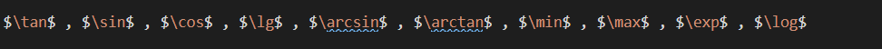

其渲染效果如下：
$\tan$ , $\sin$ , $\cos$ , $\lg$ , $\arcsin$ , $\arctan$ , $\min$ , $\max$ , $\exp$ , $\log$

## 四、运算符
运算符的写法也是如此，不过要注意的是加号、减号、等于号、大于号、小于号写法不同，是直接用符号即可。如下代码：  

其渲染效果如下：
$+$ , $-$ , $=$ , $>$ , $<$ , $\times$ , $\div$ , $\equiv$ , $\leq$ , $\geq$ , $\neq$
## 五、集合符号
方法一样。如下代码：

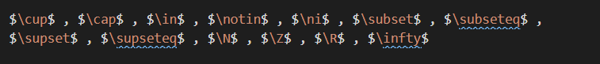

其渲染效果如下：
$\cup$ , $\cap$ , $\in$ , $\notin$ , $\ni$ , $\subset$ , $\subseteq$ , $\supset$ , $\supseteq$ , $\N$ , $\Z$ , $\R$ , $\infty$

数学符号很多，这里仅列举了一些常用的符号。

## 六、数学公式与Markdown Math
>前面只是介绍了单一的数学符号显示问题，但是一段完整的数学公式则包含多个数学符号、数值，在介绍数学公式之前，应先明确内联与块状的概念。
### 内联输出与块状输出

前面我们在输出每个符号的时候，都用两个美元符号，这种方式就是**内联**，所谓内联就是我们可以把数学符号嵌入到文字段落里面，比如： 

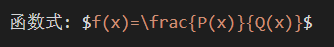

函数式: $f(x)=\frac{P(x)}{Q(x)}$ 我们可以看到这段公式在文字段落里面。

如果我们需要输出的数学公式比较复杂，或者我们需要凸出并独立显示公式，这个时候我们就需要使用到公式的块状输出，这时应使用两对美元符号，比如：

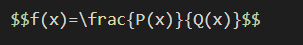

使用块状输出，函数会居中显示，并且在Markdown里会换行。效果如下：
$$f(x)=\frac{P(x)}{Q(x)}$$

### 简单的四则运算
这个在美元之间直接写就好了，没什么毛病。

### 指数输出
Markdown Math的指数运算符是^，比如：

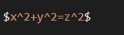

输出的结果为：

$x^2+y^2=z^2$

### n次方根输出

\sqrt{ }是开平方，注意数值用大括号围住，而开n次方的语法是\sqrt[n]{ }, 我们看下面的代码：

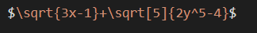

输出的结果为：

$\sqrt{3x-1}+\sqrt[5]{2y^5-4}$

### 三角公式
直接写就好，如下代码：

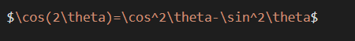

输出的结果如下：

$\cos(2\theta)=\cos^2\theta-\sin^2\theta$

### 输出分数
语法为\frac{分子}{分母}，如下代码：

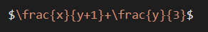

输出的结果如下：

$\frac{x}{y+1}+\frac{y}{3}$

### 求和输出
主要问题在上下标，我们用 ^ 写上标，用 _ 写下表，如下代码:

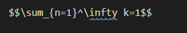

输出的结果如下：
$$\sum_{n=1}^\infty k=1$$

### 极限的输出
下标写法同上。如下代码：

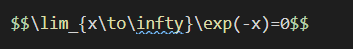

输出的结果如下：
$$\lim_{x\to\infty}\exp(-x)=0$$

### 阶乘的输出
直接加感叹号就好。如下代码：

输出的结果如下：
$$\frac{n!}{k!(n-k)!} = \binom{n}{k}$$

### 输出矩阵
使用\begin{matrix}和\end{matrix}围住即可输出矩阵，矩阵之间用 $ 来空格，用 \ \ 来换行。代码如下：

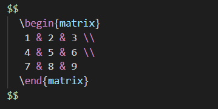

其输出结果如下：
$$
  \begin{matrix}
   1 & 2 & 3 \\
   4 & 5 & 6 \\
   7 & 8 & 9
  \end{matrix} 
$$

### 编写分段函数
分段函数是非常复杂的，这时候会用到LaTex的cases语法，用\begin{cases}和\end{cases}围住即可，中间则用\ \来分段，代码如下：

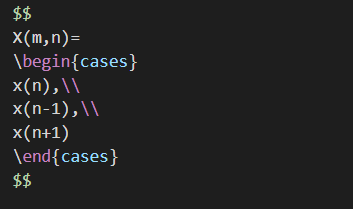

输出结果如下：
$$
X(m,n)=
\begin{cases}
x(n),\\
x(n-1),\\
x(n+1)
\end{cases}
$$