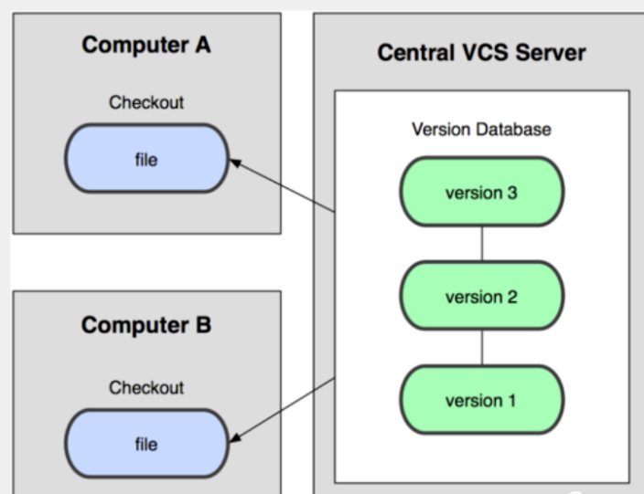

# Git学习笔记
## 一、简单了解版本控制
版本控制（Revision control）是一种在开发的过程中用于管理我们对文件、目录或工程等内容的修改历史，方便查看更改历史记录，备份以便恢复以前的版本的软件工程技术。  
* 实现跨区域多人协同开发
* 追踪和记载一个或者多个文件的历史记录
* 组织和保护你的源代码和文档
* 统计工作量
* 并行开发、提高开发效率
* 跟踪记录整个软件的开发过程
* 减轻开发人员的负担，节省时间，同时降低认为错误  

所以说版本开发可以理解为是一个管理多人协同开发项目的技术。  

**版本控制分类**：  
### 1、本地版本控制
记录文件每次的更新，可以对每个版本做一个快照，或是记录补丁文件，适合个人用，如RCS。

### 2、集中版本控制
所有的版本数据都保存在服务器上，协同开发者从服务器上同步更新或上传自己的修改，如SVN。

所有的版本数据都存在服务器上，用户的本地只有自己以前所同步的版本，如果不连网的话，用户就看不到历史版本，也无法切换版本验证问题，或在不同分支工作。而且，所有数据都保存在单一的服务器上，有很大的风险这个服务器会损坏，这样就会丢失所有的数据，当然可以定期备份。
### 3、分布式版本控制
所有版本信息仓库全部同步到本地的每个用户，这样就可以在本地查看所有版本历史，可以离线在本地提交，只需在连网时push到相应的服务器或其他用户那里。由于每个用户那里保存的都是所有的版本数据，只要有一个用户的设备没有问题就可以恢复所有的数据，但这增加了本地存储空间的占用。

每个用户都有全部代码，十分安全，不会因为服务器损坏或者网络问题造成不能工作的情况。

Git是分布式版本控制系统，没有中央服务器，每个人的电脑就是一个完整的版本库，工作的时候不需要联网，因为版本都在自己电脑上。协同的方法是这样的：比如说自己在电脑上改了文件A，其他人也在电脑上改了文件A，这时，大家只需把各自的修改推送给对方，就可以互相看到对方的修改了。Git可以直接看到更新了哪些代码和文件。
## 二、启动Git
**Git Bash**：Unix与Linux风格的命令行，使用最多。  
**Git CMD**：Windows风格的命令行。  
**Git GUI**：Git自带的图形化界面，然而我并不想用，还是用vscode吧。
## 三、常用的Linux命令
1. cd：改变目录。
2. cd .. ：回推到上一个目录，直接cd则进入默认目录。
3. pwd：显示当前所在的目录路径。
4. ls（ll）：两者都是列出目录中的所有文件，但是ll必ls列出的内容更为详细。
5. touch：新建一个文件，如 touch index.js 就会在当前目录下新建一个index.js文件。
6. rm：删除一个文件，rm index.js 就会把index.js文件删除。
7. mkdir：新建一个目录，即新建一个文件夹。
8. rm-r删除一个文件夹，rm-r src删除src目录。
9. mv：移动文件，mv index.html src，那么 index.html 是我们要移动的文件，src是目标文件夹。需明确，这样写要求文件和目标文件夹在同一目录下。
10. reset：重新初始化终端/清屏。
11. clear：清屏。
12. history：查看命令历史。
13. help：帮助。
14. exit：退出。
15. #：表示注释。
## 四、Git基本理论
Git本地有三个工作区：Working Directory 、Stage/Index 、Repository。再加上远程仓库Remote Directory就可以分为四个工作区域。我们要明确文件在这四个区域间的转换关系：

* Workspace：平时存放项目代码的地方。  
* Stage/Index：暂存区，事实上只是一个文件，临时存放进行的改动。  
* Local Repository：本地仓库，安全存放了提交到所有版本的数据。其中HEAD指向最新放入仓库的版本。
* Remote Directory：远程仓库，托管代码的服务器，用于项目组中的远程数据交换。

对于本地区域：

理解一下此图即可。  

**Git工作流程**： 

Git的工作流程一般如下：
1. 在工作目录中添加、修改文件。
2. 将需要进行版本管理的文件放入暂存区域。
3. 将暂存区域的文件提交到git仓库。

因此，git管理的文件有三种状态：已修改（modified），已暂存（staged），已提交（committed）

## 五、Git项目搭建
### 1、常用指令
以下6个：  

### 2、创建工作目录
也就是Workspace，即想要Git管理的文件夹，可以是项目的目录，也可以是空目录。最好别写中文。

### 3、本地仓库搭建
创建本地仓库有两种方法，一个是创建全新的仓库，一个是克隆远程仓库。
1. 创建全新仓库  
   用Git管理的项目的根目录执行：

      

2. 克隆远程仓库  
   将远程服务器上的仓库完全镜像一份到本地。

   
   
## 六、Git文件操作
### 1、文件的四种状态
版本控制就是对文件的版本控制，要对文件进行修改、提交等操作，首先要知道文件当前在什么状态，不然可能会提交了现在还不想提交的文件，或者要提交的文件没提交上。
* Untracked：未跟踪，即该文件在文件夹中，但没有加入git库，不参与版本控制，可通过git add变为Staged状态。
* Unmodified：文件已经入库，但未修改，即版本库中的文件快照内容与文件夹中完全一致。这种类型的文件有两个去处，如果它被修改，则变为Modified；如果使用git rm移出版本库，则变为Untracked文件。
* Modified：文件已修改。这种文件也有两个去处，如果使用git add，则变为Staged；如果使用git checkout则放弃修改，返回到Unmodified状态。这里的git checkout其实就是从库中取出文件并且覆盖当前修改。
* Staged：暂存状态。执行git commit则将修改同步到库中，这时库中的文件和本地文件又变为一致的，文件为Unmodified状态。执行git reset HEAD filename则取消暂存，文件为Modified。

### 2、查看文件状态
通过如下命令查看文件状态  

### 3、忽略文件
有些时候我们不想把某些文件纳入版本控制，那么我们可以在主目录下建立".gitignore"文件，该文件有如下规则：
1. 该文件中的空行或以#开始的行会被忽略。
2. 可以使用Linux通配符。（然而我并不了解这些概念，先记着后面再看看吧哈哈哈）例如*代表任意多个字符，？代表一个字符，[abc]代表可选字符范围，{string1,string2,...}代表可选的字符串等。
3. 如果名称的最前面有一个感叹号，则表示例外规则，将不被忽略。
4. 如果名称的最前面是一个路径分隔符 / ，则表示要忽略的文件在此目录下，注意子目录中的文件不忽略。
5. 如果名称的最后面是一个路径分隔符，则表示要忽略的是此目录下该名称的子目录，而非文件。**（默认文件或目录都忽略）**
   

