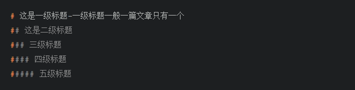
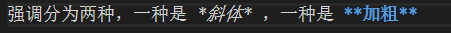
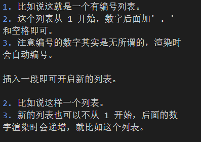
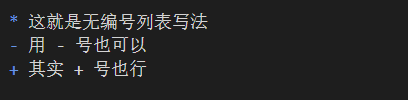
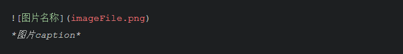
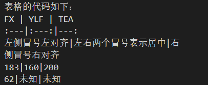
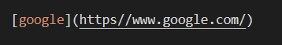
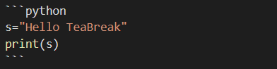

# Markdown语言学习笔记  
## 一、认识markdown
markdown是一种轻量化文本标记语言。可以理解为markdown是一种让作者将精力花费在内容（semantics）上的格式（formatting）。利用markdown写出来的文章简洁美观，可以说它是写作神器。

## 二、markdown基本格式  
### 1、标题：  
只要在文字前面打上#加空格即可，这一行的文字就会变成标题，#的个数代表标题的级别。

 
### 2、段落：
对于段落我们要特别注意一下，因为在markdown中直接按enter我们的代码虽然会换行，但其实实际渲染的效果不会换行。如果我们想要在一个段落里换行，正确的做法是先空两格再按enter。如果想要另起一段，则直接空一行即可。
### 3、强调：
强调分为两种，一种是 *斜体* ，一种是 **加粗** ，其写法如下图。



我们应注意， * 和后面要强调的文本之间不要有空格，但在 * 的前面最好空格，以保证各种markdown渲染器兼容。如果安装了 Markdown All in One，则可以像word一样用 ctrl+i 和 ctrl+b 来分别对选中的文本进行斜体或加粗。
### 4、列表：
注意这里列表不是表格，列表分为两种：顺序编号和无编号。  
#### （1）顺序编号：
1. 比如说这就是一个有编号列表。
2. 这个列表从 1 开始，数字后面加' . '和空格即可。
3. 注意编号的数字其实是无所谓的，渲染时会自动编号。

插入一段即可开启新的列表。

2. 比如说这样一个列表。
3. 新的列表也可以不从 1 开始，后面的数字渲染时会递增，就比如这个列表。  
  
以上两个列表的代码如下图：


#### （2）无编号：
其代码如下：



渲染出来的效果即是这样的：
* 这就是无编号列表写法
- 用 - 号也可以
+ 其实 + 号也行  
  
对了，如果用了Markdown All in One，则很多可以自动补全，注意一下就好。
### 5、插入图片：
直接把图片复制到文章目录下，用以下语法加入图片：  


除了文件名，其他的描述和图片caption都是可选的。描述即为把鼠标停留在图片上显示的文字。

需明确，Markdown All in One 让我们在打出 ![ ] 后能自动补全图片文件名，从而快速输入。（图片要先存在文章目录里）  

还值得注意的是，如果安装了Paste Image插件，那我们可以直接复制图片，再按ctrl+alt+v粘贴就可以了，十分方便。
### 6、表格
表格的代码如下：



其渲染出来的效果如下：
FX | YLF | TEA
:---|:---:|---:
左侧冒号左对齐|左右两个冒号表示居中|右侧冒号右对齐
183|160|200
62|未知|未知

首先用 | 来定义列， :---| :---: |---: 这串代码放在第一列下面用于区分表头，并且表示各列中的文本是左对齐还是右对齐。 
**还需注意，不加冒号则默认为左对齐。**
### 7、链接
链接可以连接到网上某个url网址，代码如下：



括号内即是要链接的文字
其渲染效果如下：
[google](https//www.google.com/)
如果用了Markdown All in One，则可以直接选定要链接的文字，然后按ctrl+v粘贴则可以自动生成链接。
### 8、代码块
Markdown可以渲染代码，如果渲染器支持可以实现各种语言语法的高亮。  
其代码如下：



其渲染效果如下：
```python
s="Hello TeaBreak"  
print(s)
```
注意需要在第一个```之后写明代码语言才会出现高亮。
### 9、引用
在需要引用的一行前加上>即可。
其渲染效果如下：  
>这就是一段引用
### 10、分割线
单独一段打上---即可  
比如下面就是一个分割线  

---


